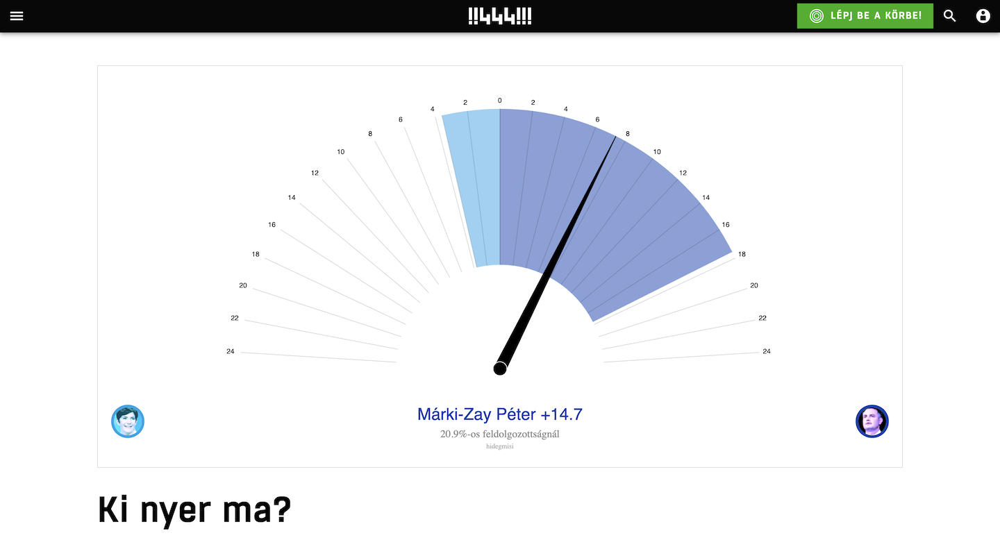

```{=html}
<div class="ProjectDetail">
```

```{=html}
<header class="project-detailHeader">
<article class="project-detailCard">
<a class="project-thumbLink" href="https://444.hu/2021/10/17/ki-nyer-ma" target="_blank" rel="noopener noreferrer"></a>
<div class="project-detailBody">
<div class="project-head">
<div class="project-detailTitle">Predictive election needle</div>
<div class="project-meta">2021 • 2021-10-17</div>
<div class="project-org">444.hu</div>
</div>
<p class="project-excerpt">An election needle that narrowed down the possible outcomes during the night of the opposition primaries.</p>
<div class="project-tags"><span class="project-tag">444</span>
<span class="project-tag">data visualization</span></div>
<div class="project-detailActions"><a class="project-detailLink" href="https://444.hu/2021/10/17/ki-nyer-ma" target="_blank" rel="noopener noreferrer">Open project ↗</a></div>
</div>
</article>
</header>
```



```{=html}
</div>
```
