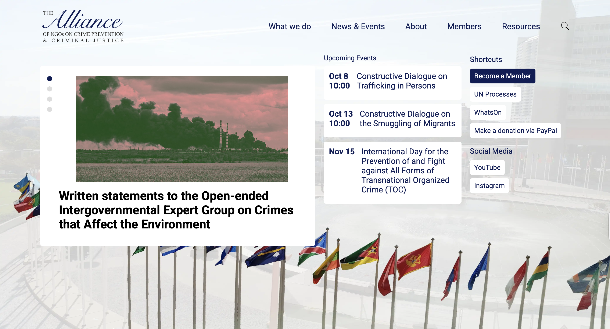

```{=html}
<div class="ProjectDetail">
```

```{=html}
<header class="project-detailHeader">
<article class="project-detailCard">
<a class="project-thumbLink" href="https://crimealliance.org/" target="_blank" rel="noopener noreferrer"></a>
<div class="project-detailBody">
<div class="project-head">
<div class="project-detailTitle">CPCJ Alliance website</div>
<div class="project-meta">2019- • 2019-12-13</div>
<div class="project-org">Alliance of NGOs on Crime Prevention and Criminal Justice</div>
</div>
<p class="project-excerpt">A website for an NGO umbrella organization advancing a crime prevention and criminal justice agenda.</p>
<div class="project-tags"><span class="project-tag">website</span></div>
<div class="project-detailActions"><a class="project-detailLink" href="https://crimealliance.org/" target="_blank" rel="noopener noreferrer">Open project ↗</a></div>
</div>
</article>
</header>
```

```{=html}
</div>
```
