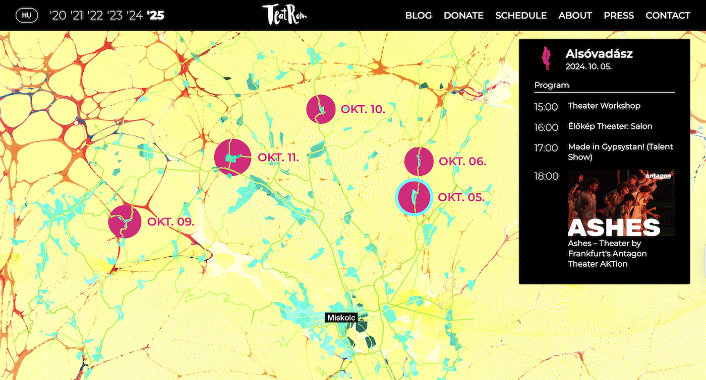

```{=html}
<div class="ProjectDetail">
```

```{=html}
<header class="project-detailHeader">
<article class="project-detailCard">
<a class="project-thumbLink" href="https://teatrom.hu/en" target="_blank" rel="noopener noreferrer"></a>
<div class="project-detailBody">
<div class="project-head">
<div class="project-detailTitle">TeatRom Website</div>
<div class="project-meta">2024 • 2024-09-14</div>
<div class="project-org">Utcaszínházi Alkotóközösség</div>
</div>
<p class="project-excerpt">The website of the TeatRom festival organized by the Utcaszínházi Alkotóközösség for Roma children living in one of the most beautiful and impoverished areas of Northern Hungary, in the Cserehát region. It is no longer maintained by me.</p>
<div class="project-tags"><span class="project-tag">website</span></div>
<div class="project-detailActions"><a class="project-detailLink" href="https://teatrom.hu/en" target="_blank" rel="noopener noreferrer">Open project ↗</a></div>
</div>
</article>
</header>
```

```{=html}
</div>
```
