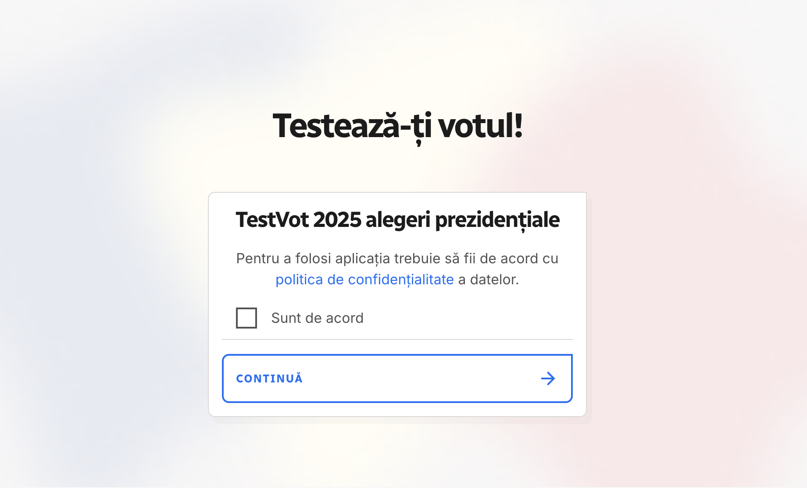

```{=html}
<div class="ProjectDetail">
```

```{=html}
<header class="project-detailHeader">
<article class="project-detailCard">
<a class="project-thumbLink" href="https://www.testvot.eu/" target="_blank" rel="noopener noreferrer"></a>
<div class="project-detailBody">
<div class="project-head">
<div class="project-detailTitle">TestVot 2025</div>
<div class="project-meta">2024-25 • 2024-11-15</div>
<div class="project-org">Median Research Centre</div>
</div>
<p class="project-excerpt">A voting advice application for Romanian elections, based on Česko.Digital’s volebni-kalkulacka.</p>
<div class="project-tags"><span class="project-tag">website</span></div>
<div class="project-detailActions"><a class="project-detailLink" href="https://www.testvot.eu/" target="_blank" rel="noopener noreferrer">Open project ↗</a></div>
</div>
</article>
</header>
```

```{=html}
</div>
```
