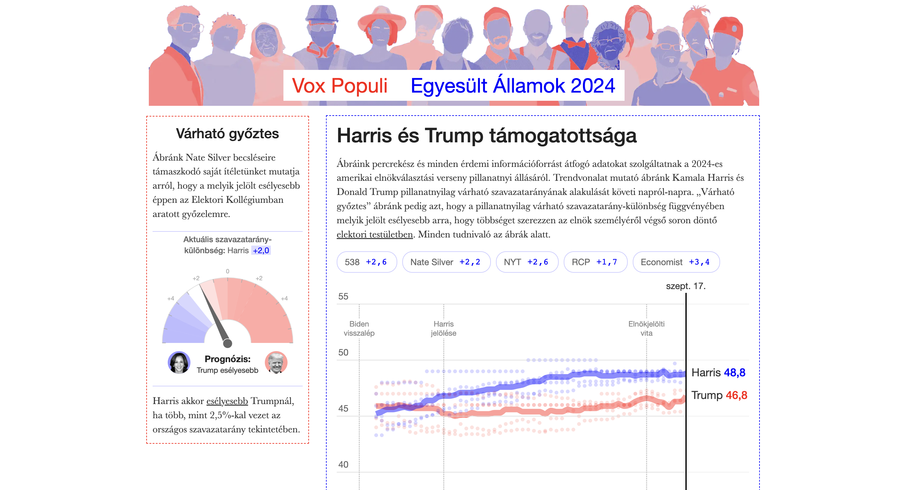

```{=html}
<div class="ProjectDetail">
```

```{=html}
<header class="project-detailHeader">
<article class="project-detailCard">
<a class="project-thumbLink" href="https://hidegmisi.github.io/us2024_tracker/" target="_blank" rel="noopener noreferrer"></a>
<div class="project-detailBody">
<div class="project-head">
<div class="project-detailTitle">Vox Populi: US 2024</div>
<div class="project-meta">2024 • 2024-09-17</div>
<div class="project-org">Vox Populi</div>
</div>
<p class="project-excerpt">An aggregator of the main polling aggregators for the 2024 US elections by the Vox Populi blog.</p>
<div class="project-tags"><span class="project-tag">data visualization</span>
<span class="project-tag">vox populi</span>
<span class="project-tag">website</span></div>
<div class="project-detailActions"><a class="project-detailLink" href="https://hidegmisi.github.io/us2024_tracker/" target="_blank" rel="noopener noreferrer">Open project ↗</a></div>
</div>
</article>
</header>
```

```{=html}
</div>
```
