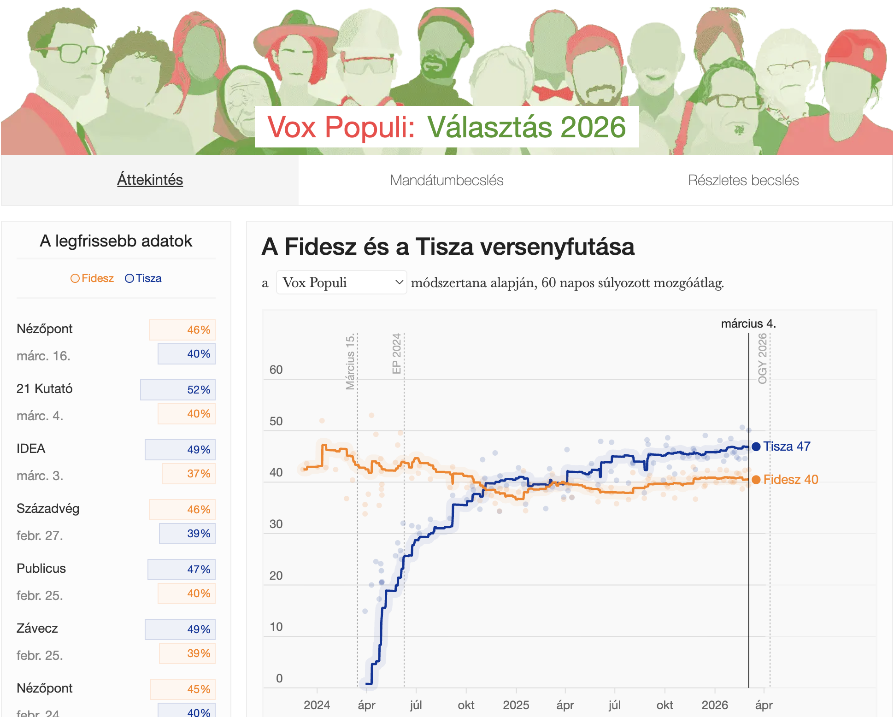

```{=html}
<div class="ProjectDetail">
```

```{=html}
<header class="project-detailHeader">
<article class="project-detailCard">
<a class="project-thumbLink" href="https://2026.kozvelemeny.org/" target="_blank" rel="noopener noreferrer"></a>
<div class="project-detailBody">
<div class="project-head">
<div class="project-detailTitle">Vox Populi: Választás 2026</div>
<div class="project-meta">2025-26 • 2026-03-14</div>
<div class="project-org">Vox Populi</div>
</div>
<p class="project-excerpt">The website shows the polling aggregation and mandate projection made by the Vox Populi blog by Gábor Tóka for the 2026 elections.</p>
<div class="project-tags"><span class="project-tag">data visualization</span>
<span class="project-tag">vox populi</span>
<span class="project-tag">website</span></div>
<div class="project-detailActions"><a class="project-detailLink" href="https://2026.kozvelemeny.org/" target="_blank" rel="noopener noreferrer">Open project ↗</a></div>
</div>
</article>
</header>
```



```{=html}
</div>
```
